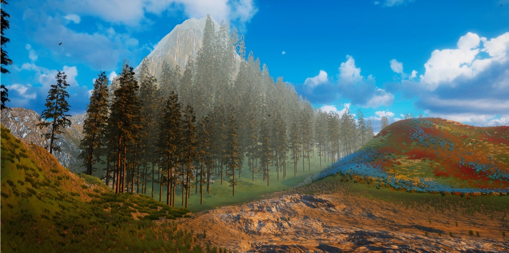
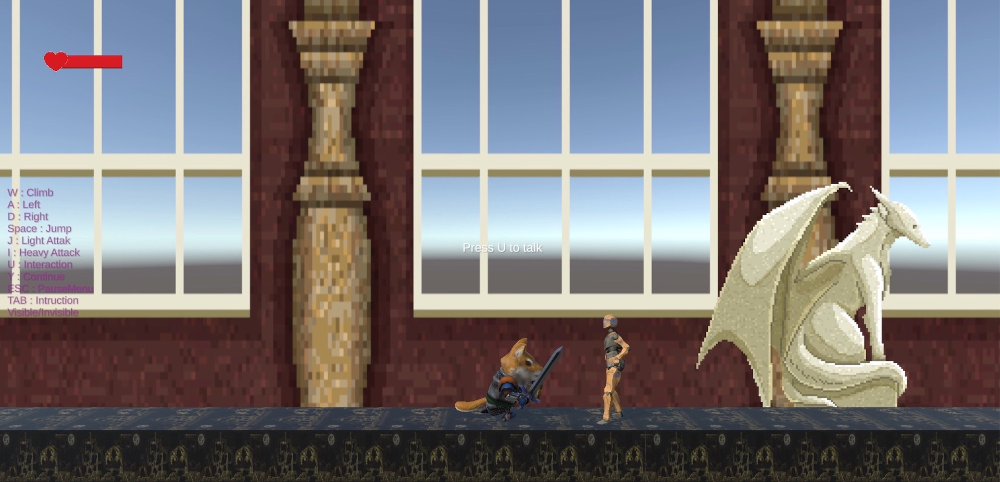
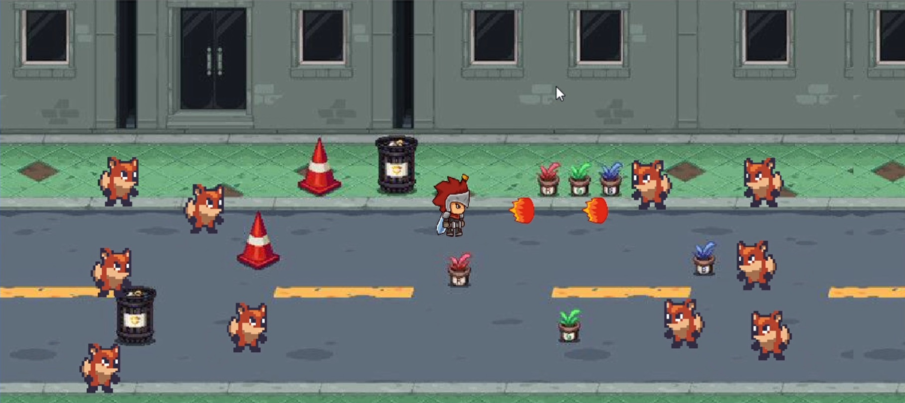
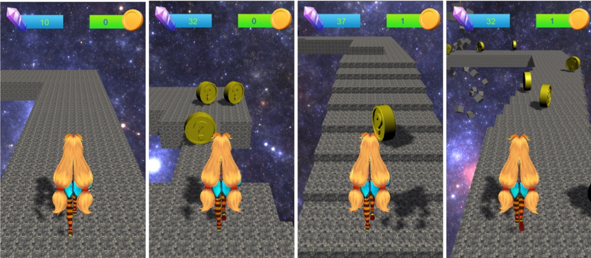
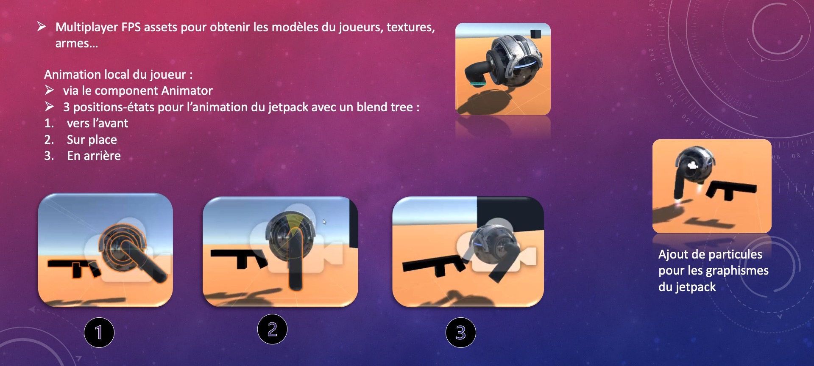
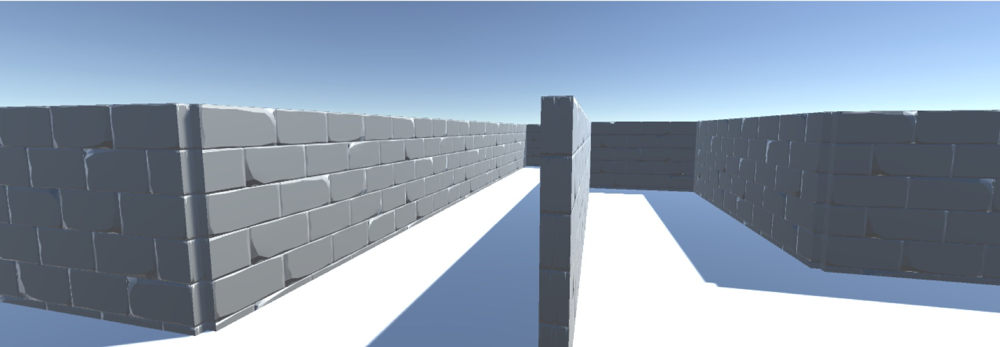

# Students projects (2020)

<!-- fayolle_xia -->
## Cat at sunset
Roam across hills and forests looking for your lost cat. Listen carefully and you may just find it.

<!-- chaoyi -->
## Between Hollow Knight and Blasphemous
A pixel art beat-them-all platformer.

<!-- (levy_deyed_yang) -->
## Fox scourge
A 2D survival game where, controlling a fireball throwing knight, you're in charge of cleaning the streets from wandering foxes.

<!-- zhang_wang -->
## Parkour run
Temple run like game with a flare of japanime.

<!-- ziadah -->
## Multiplayer FPS
An ambitious multi-player first person shooter game. Not finalized, but plenty of interesting concepts here.

<!-- ziane -->
## Procedural maze
Wander through a procedural maze, in search of time gems.

